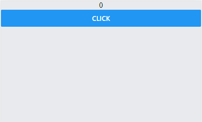
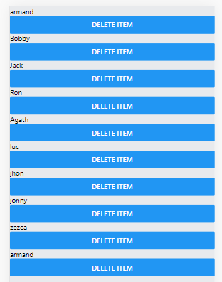

# Workshop-React-Native

<!-- Présentation du workshop
    Pré-requis
    Installation
    Projets/exo de base
    Css
    Dev Appli mobile
     -->

## Création d'une app Mobile.

Qu’est ce que react NATIVE ?

React NATIVE est un FrameWork open source qui permet de créer des applications mobile android/ios grâce à React. Il utilise des api javascript pour notre interface utilisateur à l’aide de composants react (« composant react est un block de code réutilisable ») prêt à l’emploi, créer ses propres components.
Rappel : Avant de commencer react NATIVE, il faut impérativement avoir des bonne notions en react, càd props , hooks , components , state…

### Pré-Requis

1. Nodejs.
2. Android studio / Expo.
3. ES7.
4. EXPO sur mobile.

### Installation

Se rendre sur le site : [expo](https://docs.expo.io/)

Expo sur desktop :

1. Se rendre sur votre cmd : `npm install -g expo-cli –global`

2. Une fois l'installation expo fini, se rendre dans le directory de votre projet à l'aide du terminal : `expo init nom-projet`

3. Choisir un template : ici pour nos exercices et application on choisira "blank" enter

4. Lancer l'application : `expo start`

Expo sur mobile :

Afin de voir les resultats sur notre smartphone.

1. Se rendre sur l'app store / play store installer expo.
2. Scanner le QRCODE apres avoir lancer expo start.

Alternative android studio (émulateur) :

Se rendre sur le site : [android](https://developer.android.com/studio)

Une fois l'installation réalisée :

1. Cliquer sur "Configure" sélectionner AVD manager
2. Créer un virtuel device
3. Category "phone" -> choisir un smartphone
4. Appuyer sur "next"
5. Choisir la version Android "Pie"

une fois l'installation de votre version fini, lancer le virtual devise, connectez-vous à votre compte google et installation expo voir étape au-dessus.

### Exercices :

Avant de commencer à développer notre première application , commençons par quelques exercices.
Tout d'abord, après avoir créé votre projet, aller sur le fichier "App.js".

```javascript
import { StatusBar } from "expo-status-bar";
import React from "react";
import { StyleSheet, Text, View } from "react-native";

export default function App() {
  return (
    <View style={styles.container}>
      <Text>Open up App.js to start working on your app!</Text>
      <StatusBar style="auto" />
    </View>
  );
}

const styles = StyleSheet.create({
  container: {
    flex: 1,
    backgroundColor: "#fff",
    alignItems: "center",
    justifyContent: "center",
  },
});
```

Ce code correspond au code par défaut de notre application. Il affiche simplement ce qu'il y a dans `<Text>Open up App.js to start working on your app!</Text>`

Premier exemple :

Dans cet exercice, nous allons voir comment utiliser les components de react Native ainsi que des hooks (useState).

Tout d'abord, nous allons avoir besoin de créer 2 useState.

```javascript
import React, { useState } from "react";
import { StyleSheet, Text, View } from "react-native";

export default function App() {
  // definir les useState
  const [name, setName] = useState("Jhon");
  const [person, setPerson] = useState({ name: "mario", age: 40 });

  return <View style={styles.container}>// Afficher nos data ici</View>;
}

const styles = StyleSheet.create({
  container: {
    flex: 1,
    backgroundColor: "#fff",
    alignItems: "center",
    justifyContent: "center",
  },
});
```

Ensuite pour afficher les données passées à nos useState.

```javascript
import React, { useState } from "react";
import { StyleSheet, Text, View } from "react-native";

export default function App() {
  const [name, setName] = useState("Jhon");
  const [person, setPerson] = useState({ name: "mario", age: 40 });

  return (
    <View style={styles.container}>
      <Text>My name is {name}</Text>
      <Text>
        His name is {person.name} his age {person.age}
      </Text>
    </View>
  );
}

const styles = StyleSheet.create({
  container: {
    flex: 1,
    backgroundColor: "#fff",
    alignItems: "center",
    justifyContent: "center",
  },
});
```

Jusqu'a présent, nous avons appris comment utiliser useState et afficher les données. Maintenant, si nous voulons modifier une valeur que l'on passe à ceux-ci.

```javascript
import React, { useState } from "react";
import { StyleSheet, Text, View, Button } from "react-native";

export default function App() {
  const [name, setName] = useState("Jhon");
  const [person, setPerson] = useState({ name: "mario", age: 40 });

  const clickHandler = () => {
    setName("Ronny");
  };
  return (
    <View style={styles.container}>
      <Text>My name is {name}</Text>
      <Text>
        His name is {person.name} his age {person.age}
      </Text>
      <View>
        <Button title="update name" onPress={clickHandler}></Button>
      </View>
    </View>
  );
}

const styles = StyleSheet.create({
  container: {
    flex: 1,
    backgroundColor: "#fff",
    alignItems: "center",
    justifyContent: "center",
  },
});
```
exercice counter : 

- crée un compteur en utilisant les useState vue juste avant et incrementer sa valeur a chaque click du button.




Deuxieme exemple :

Dans cet exemple nous allons voir comment passer et changer le state d'une variable en utilisant des input.

```javascript
import React, { useState } from "react";
import { StyleSheet, Text, View, Button, TextInput } from "react-native";

export default function App() {
  const [name, setName] = useState("Jhon");
  const [age, setAge] = useState("23");

  return (
    <View style={styles.container}>
      <Text>Enter your name : </Text>
      <TextInput style={styles.inputName} placeholder="name..."></TextInput>

      <Text>Enter your age : </Text>
      <TextInput style={styles.inputAge} placeholder="age..."></TextInput>
    </View>
  );
}

const styles = StyleSheet.create({
  container: {
    flex: 1,
    backgroundColor: "#fff",
    alignItems: "center",
    justifyContent: "center",
  },
  inputName: {
    borderWidth: 4,
    borderColor: "#000",
    padding: 5,
  },
  inputAge: {
    borderWidth: 4,
    borderColor: "#000",
    padding: 5,
  },
});
```

Afin de pouvoir changer nos state à partir d'un input, nous avons besoin de fonctions et de la propriété onChangeText sur nos Inputs.

```javascript
const handleInputLetter = (name) => {
  let regex = /^[a-zA-Z ._-]*$/;
  if (regex.test(name)) {
    setName(name);
  } else {
    console.log("only letter");
  }
};
const handleInputAge = (age) => {
  let regex = /^[0-9\b]+$/;
  if (regex.test(age)) {
    setAge(age);
  } else {
    console.log("error enter a number for your age");
  }
};
return (
  <View style={styles.container}>
    <Text>Enter your name : </Text>
    <TextInput
      style={styles.inputName}
      placeholder="name..."
      onChangeText={handleInputLetter}
    ></TextInput>

    <Text>Enter your age : </Text>
    <TextInput
      style={styles.inputAge}
      placeholder="age..."
      onChangeText={handleInputAge}
    ></TextInput>
    <Text>
      Name: {name} - age:{age}
    </Text>
  </View>
);
```

CSS pour les inputs

```javascript
inputName:{
    borderWidth: 4 ,
    borderColor : "#000",
    padding: 5
  },
  inputAge:{
    borderWidth: 4 ,
    borderColor : "#000",
    padding: 5
  }
```

Troisième exemple :

Dans cet exemple, nous allons voir comment utiliser des listes, les components et les props.

Pour ce faire, il faut :

- Créer un dossier "components" dans lequel vous devez créer un fichier "Listing.js"

Tout d'abord aller sur App.js

```javascript
  const [people,setPeople] = useState([
    {name:"armand" , id:1},
    {name:"Bobby" , id:2},
    {name:"Jack" , id:3},
    {name:"Ron" , id:4},
    {name:"Agath" , id:5},
    {name:"luc" , id:6},
    {name:"jhon" , id:7},
    {name:"jonny" , id:8},
    {name:"zezea" , id:9},
    {name:"armand" , id:10},
  ])

  return (
    <View style={styles.container}>
      // Ici nous passons la liste à un props appelé "people" il sera réutilisable dans notre component crée dans Listing.js
     <Listing people={people}/>
    </View>
  );
}
```

Ensuite Listing.js

```javascript
import React, { useState } from "react";
import {
  StyleSheet,
  Text,
  View,
  Button,
  TextInput,
  ScrollView,
} from "react-native";
// people est le props reçu par App.js
const Listing = ({ people }) => {
  return (
    <View>
      <ScrollView>
        // On accede à chaque element de notre list à l'aide de map
        {people.map((item, index) => {
          return (
            <View key={item.id}>
              <Text style={styles.itemPeople}>{item.name}</Text>
            </View>
          );
        })}
      </ScrollView>
    </View>
  );
};

const styles = StyleSheet.create({
  itemPeople: {
    fontSize: 96,
    marginTop: 24,
    backgroundColor: "#FEAF",
  },
});
export default Listing;
```
<<<<<<< HEAD

exercice final : Il faut crée une list et faire en sort de pouvoir supprimer les elements de cet liste un à un..

Resultat : 



=======
>>>>>>> aa1809665f6141dc25e2b77cbef4090037d52342
